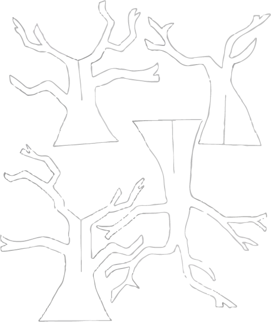
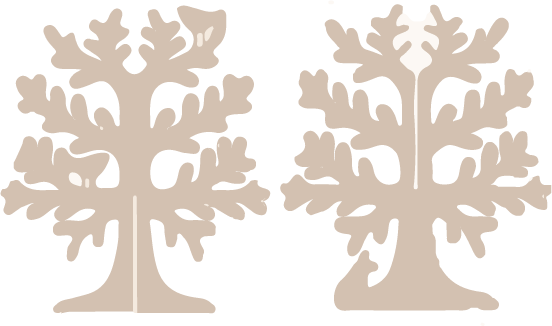

# Blog Post #2

## Updates:

This week I decided to start being more assertive with my capstone and taking concrete steps to making the project happen. This included holding auditions, meeting with Jon Bonner and writing the first draft of the script.

## What I did:

### Papa Bois:

In regards to Papa Bois, I met with Jon Bonner and we created a plan for making the trees. We discussed the material and the decoration and timeline for the project. We also spoke about the lighting of the project and he agreed to assist me when we get to that point. 

I created vector files of some tress and sent of to Jon for testing with the CNC machine. One he gives the sign off we will start printing. 

The above photos are images of the vector files for the trees. 

### The Script

I wrote the first draft of the script for each of the scenes. This was really helpful because it helped me better envision what I want for each scene. A copy of the first draft can be found [here]()

### Auditions:

I hosted the auditions for my dancers and are very close to deciding who will play what roles. I had 6 people apply. I thought them a short choreo to see how quickly they would get it and then I watched them perform their own piece to a song I pre-assigned. 

The decision is very difficult but I think I should have a solid team. I still have one more audition to do and then I can release the positions. I took videos of the auditions but for the sake of the performers' privacy I will not post them publicly. 

## Next Steps:

The next steps would be:
- to follow up with Jon with Papa Bois
- to discuss witht eh Arts Center and the department about the fate of my project
- to spend more time working with Sox to organise the audio manipulation
- to try using the kinect from overhead to see if that would give better results.
