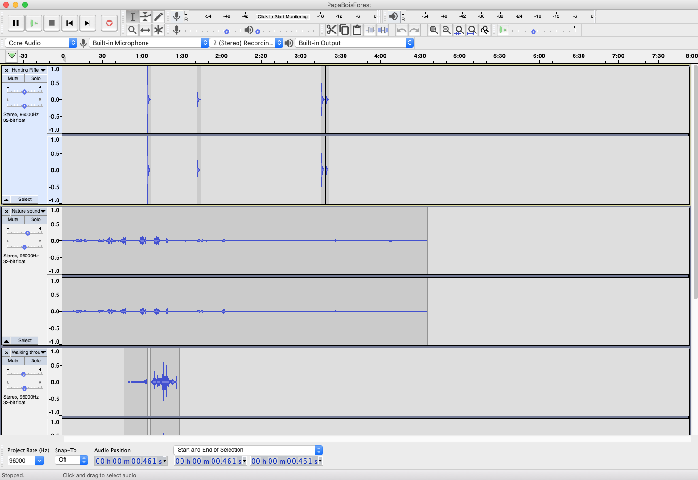

# Blog Post #4

## Updates: 

I have been making good progress with the various aspects of my project. Hopefully they will all come together nicely.

## What I did:

### Soucouyant

#### Tech:
For the Soucouyant I have started testing projection mapping using MadMapper to see how the flames look blown up. I am using average point tracking to follow the movement of the dancer. It has been a little difficult testing that because of the other stuff such as tables messing up the calculation. I spoke to Aaron about rectifying this and he said this should not be an issue in the black box. I am going to try clearing out my studio and trying it there.

I also spoke to Aaron about the wiring in the Black Box and CHris suggested and he was very helpful.

I also found the perfect sound to mix with the poem as the backing track

#### Rehearsal:
Additionally I started rehearsals with Khushi and we made good progresswith characterization. I also ordered her body suit which will arrive next week so that I have enough time is there needs to be any resizing

### Papa Bois

#### Tech

I have trees!

Jon, printed out a small version of the tree (see below). This prototype helped see if the vector files were working. One of the files worked but the other gave trouble. We are still working on it ans should have big trees soon.
I also ordered the first batch of Neopixels which should arrive by the end of the week so that I could start wiring the trees.

I mixed the music for this scene and used it to code the light reaction to the trees. I am going to test out the code with the neopixels within the next couple of days before wiring it to the trees.

#### Rehearsal

I had my first rehearsal with Yerkebulan which went pretty well. We worked on characterization and will start choreo in the next session.

### Douens

#### Tech 
Thanks to the help of Heather, I was able to get Sox up and running. I tested some of the manipulation factors and they all more or less worked. I am still trying to figure out how to distort the sound as this is not in the documentation. I will continue working on this next week.

#### Rehearsal

My first rehearsal with Shalini and Salma are scheduled for tomorrow (Wednesday). I am really looking forward to working with them. I also looked into making loin cloths and will collect their hats today.

### Other:

I will be getting books from the library to use in the gallery and will reach out the them to make posters. 

I also filled out the in person request form and hope to hear more about it soon.

## Next Steps:

The next steps would be to start polishing the Papa Bois and Soucouyant Scenes and working on the sound for the Douens Scene.
I will also start fully scaling set and working on costume 
Continue rehearsals with dancers
