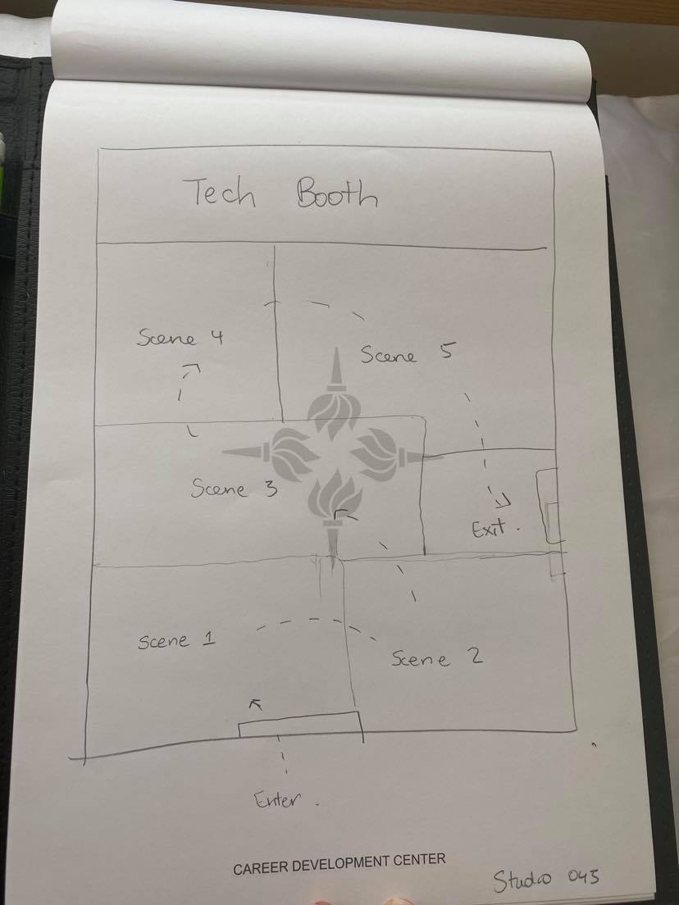

# Blog Post 1 - RED

## Description

For my first protoype for my capstone project. I want to reference a project [Red](https://www.youtube.com/watch?v=Az-puxr6F40&list=PLby9sGn7NkDtys4yqW0JFWzx-iIpVB42P&ab_channel=GabiBranche) that I did for my midterm in the class Site Specific Immersive Dance Theater in New York this spring. While the project does not have the sensory interactivity that I want to include in my final capstone project, it does hone in on the idea of immersive physical theater which I would like to be the driving force of the project. 

Using RED I started thinking about the spatial structure of my final and created a floor plan, designed for Studio 045 (where I hope I can use for my final project). 

I'm not really sure how to make a prototype for a theater piece, particularly one that does not have a story line yet so I used this time to think more on which direction I want to take the story.

My challenge is that if I tell my own story and not just do an adaptation, I'm still not sure what I want it to be about. I know I would want it to have a moral at the end and to explore a theme that I believe worth discussing but I don't know yeat what that is. I am gearing towards more abstract characters for my dancers. Right now I'm thinking along the lines of a cat and mouse dialogue but this is still a very rough idea. I also know that since this should be more dance oriented than theatrical I know I want it to have very little dialogue and rely solely on the interaction with the space, the audience and the performers.

**Next Steps**

For my next personal assignment I am going to narrow down to three themes and write short stories (no longer than 2 paragraphs) for each of the themes chosen.

