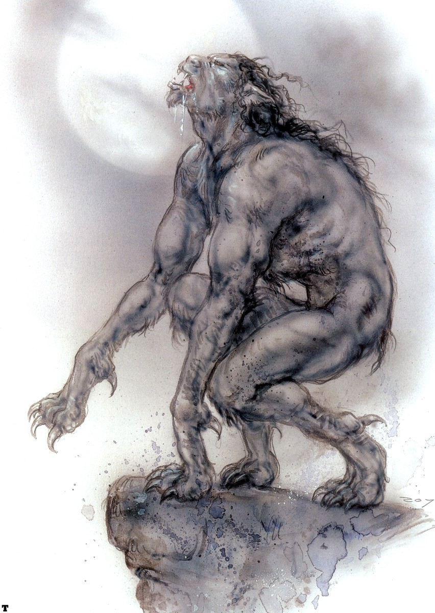
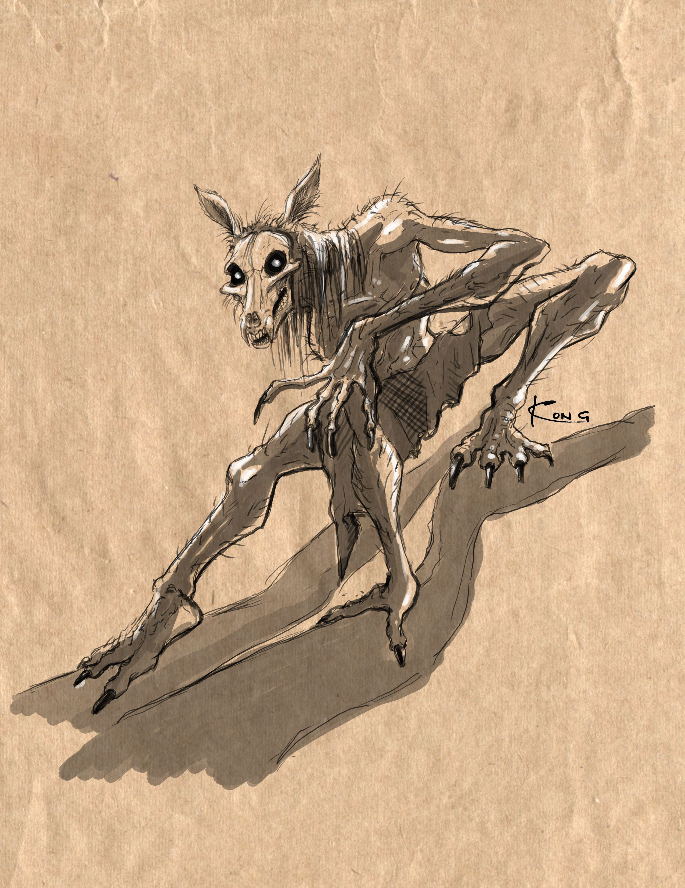
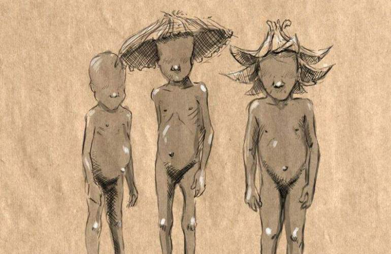
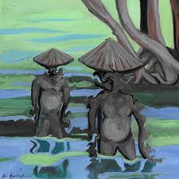
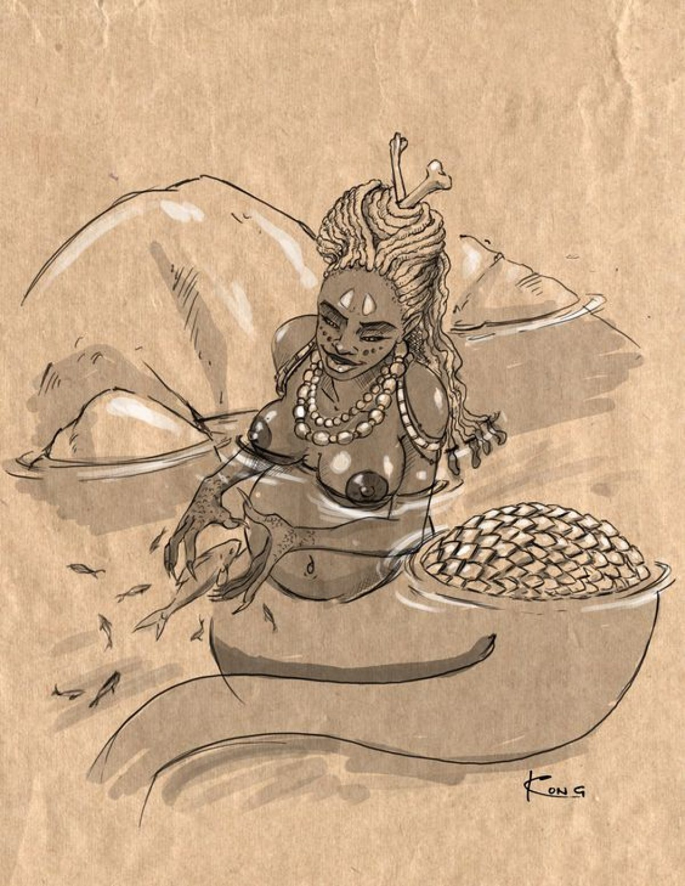
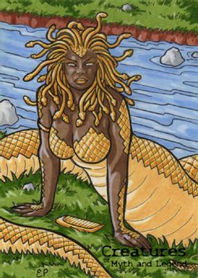
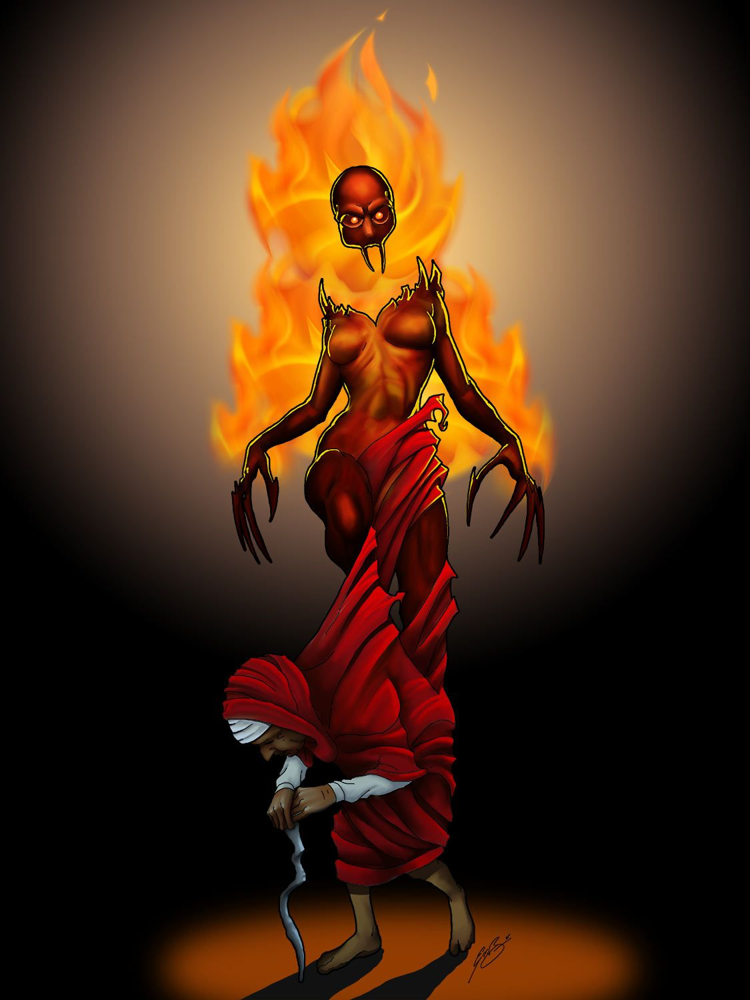
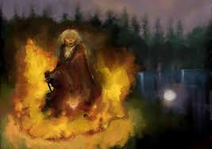

# Blog Post 2

## Updates

Based on the feedback and discussion which happened in class last week, I decided to shift my story to a more local sphere. I now decided that each scene would be dedicated to a different Trinidadian Folklore character. This means that there would not be one continues storyline but each scene would be almost mutually exclusive.

## What I did

### Research

The first thing I needed to do was to research the mythical characters I grew up with. Below are synopsis of the 5 characters I selected for my performance:

#### Lugarhoo

A Lugarhoo (Lagahoo or Loup Garou) is a person who can change themselves into a half animal from the torso down; and can also alter its size from tiny to very large in an instant. This is done at night as it rattles and drags chains and carries in its hand a whip-like bunch of dried sticks and reeds.

Old people talk: If you want to see a lugarhoo and not be seen by it, take some yampee from the corner of a dog's eye, put it in your eye and peep out of a key hole at 12 midnight.
 
#### Douens

Douens (Dwens) are the souls of children who have died before they were baptized. They are doomed to roam the earth forever. They are seen playing in forests and near rivers and the odd thing about them is that they have no faces and their feet are turned backwards. They may approach children and lead them astray in the forest until they are lost, or they may come near people's houses at night, crying and whimpering.

Old people talk: To prevent the Douens from calling your children into the forest at dusk, never shout their names in open places, as the Duennes will take their names, call them and lure them away.
 
#### Mama Glow or Mama Dlo or Mama Dglo

"Mama Glow" or "Mama Dlo" or "Mama Dglo" whose name is derived from the French "maman de l' eau" which means "mother of the water" is one of the lesser known personalities of Trinidad and Tobago folklore. A half woman, half snake with long flowing hairwhich she combs constantly. Her upper torso is a naked, beautiful woman, the lower part coils into a large form of an anaconda snake that is hidden beneath the water. She is sometimes thought to be the lover of Papa Bois, and old hunters tell stories of coming upon them in the 'High Woods'. They also tell of hearing a loud, cracking sound which is said to be the sound made by her tail as she snaps it on the surface of a mountain pool or a still lagoon. Mortal men who commit crimes against the forest, like burning down trees or indiscriminately putting animals to death or fouling the rivers could find themselves married to her for life, both this one and the one to follow. Sometimes she takes the form of a beautiful woman 'singing silent songs on still afternoons, sitting at the water's edge in the sunlight, lingering for a golden moment, a flash of green - gone. Nothing but a big Morte Bleu, rising in the sun beams.

Old people talk: "Did you see a fish jump?" "Yes, but it did not go back in again!" If you were to meet Mama Dlo in the forest and wish to escape her, take off your left shoe, turn it upside down and immediately leave the scene, walking backwards until you reach home.
 
#### Papa Bois

Papa Bois, also called Maitre Bois, lives in the forest and he is the father or protector of the animals that live there. He is often seen by hunters and other people who live near the forest. He gets animals out of snares and treats sick animals at his dwelling. He is an old man who is very hairy, like an animal and usually is only dressed in a pair of ragged trousers with a bamboo horn hanging from his belt. He can turn himself into the form of a large stag or any other animal as well to be able to observe the hunters unnoticed. He is usually very kind, but can be dangerous when crossed. He might even cast a spell on a bad hunter and turn him into a wild hog.
 
#### Soucouyant

The Soucouyant (Sukuya), also called Old Hag, is a supernatural being who has made a pact with the devil to be able to change herself into all kinds of different forms. At night she sheds her human skin and changes into a ball of fire or any kind of animal and casts spells on people to turn them into animals also, but she has to slip back into that skin before dawn breaks and the cock crows, otherwise she will not be able to get back into it. So it may happen, that, when people suspect that an old woman neighbour of theirs is, in fact, a soucouyant, they may trick her by going to her house at night and destroying the skin she left behind by putting salt on it so that it will shrink and she will not be able to get back into it and thus die. In Trinidad, if somebody walks around with a "hicky" (soukie) on his neck, he may get remarks from his friends like: " Eh, Eh, Soucoyant suck yuh or wha ? "

Old people talk: If you wish to discover who the Soucouyant in your village is empty 100 lbs of rice at the village crossroads where she will be compelled to pick them up, one grain at a time - that is how you'll know the Soucouyant.
 
### Protoype

The next thing was to start protoyping the environement that I would want for the characters. This week I chose to focus on the **soucouyant**. I brainstormed the environment I want for her. I would want there to be a large flame around her that follows her movemments. WHen the audience meets her they would have to find her skin and throw salt on it that sould defeat her. I started playing around with processing flame sketches and created this prototype. The flame currently follows the mouse, however once we get access to the lab and equipment, I would want to scale this up uing potentially an IR camera and flex sensors. 

See video of protoype [here](https://youtu.be/bOigaOtRZFw)

## Next Steps

Next steps would be to protoype the other characters. Hopefully I will get access to the Art Center soon as based on my ideas right now, the other characters are more dependent on physical computing.

Additionally, I will look more into the stories.
