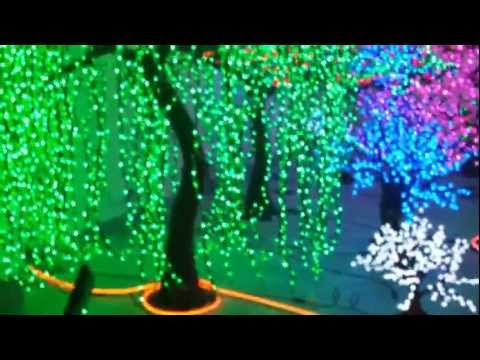
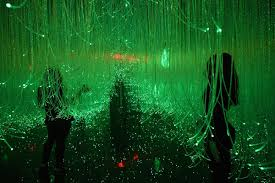

# Blog Post 3

## Updates:

This weeks assignment was to create an Bio and Artist Statement and to continue working on our prototypes. One of the suggestions which was given during feedback last week was to juxtopose the way the folklore are told to children as opposed to what they really are. 

## What I did:

### Draft Bio

*Gabrielle Branche* (Trinidad and Tobago) is a student at NYU Abu Dhabi majoring Interactive Media with a minor in Dance. She has studied in multiple counties including the UAE, USA, Germany, and China. As an Interactive Media artist, she has focused on integrating physical computing with theater and dance. She has used robotics, remote sensors, and AR technology to create immersive dance and theatrical pieces. She has also interned in leading UK based VR company Atlantic Productions’ Alchemy VR. Gabrielle has been dancing for the past 20 years. She started instructing dance in the UAE for over 2 years and has worked at the Alvin Ailey American Dance Theater as the Arts in Education Intern and as the Virtual Ailey Camp Content Manager in the 2020 New York and Newark camps. She is currently based in Abu Dhabi where she is completing her final year of her bachelor’s degree.

### Draft Artist Statement

Art is a large umbrella and I find solace in every aspect of it. I strive to make art that intersects. I have always been deeply immersed in the arts having started dancing, singing, writing, and acting from a very tender age. Nevertheless, I had interests beyond the arts particularly in the STEM field. Interactive Media provided me with a space to combine all my passions by creating intersectional art. 

As a performer, I am constantly finding ways to integrate technology into the performing arts. As an aspiring educator, I am constantly abstracting the lessons that are rooted in the arts to explore different themes and to stimulate thought-provoking ideas.
We live in a world in which technology is rapidly being normalized in all spheres of life and I am of the firm belief that the arts should not be left behind. However, while some forms of art such as music and visual art are more conducive to these changes, in the forms of art to which I am drawn, namely dance and theater, this transition is more difficult.

I use my knowledge of technology to explore intersectional and educational art. By using physical computing, remote sensors, and AR technology, I specify in creating immersive dance and theatrical pieces. I found inspiration in work such as Tokyo’s TeamLab Galleries, Artechouse in New York, and Third Rail Projects such as Then She Fell. These projects have prompted me to further explore the integration of the physical and the digital. I strive to make art that can exist in a transient space where technology, audience and performer can coexist. 

Coming from the small twin island of Trinidad and Tobago, I am inspired to integrate my local culture into many of my pieces. We have found ways to integrate and celebrate our melting pot of culture in our daily lives. For example, Carnival can be considered one large immersive theatrical spectacle, showcasing our rich music, history, and diversity. My relationship which Trinidadian culture has influenced my pull towards intersectional art. Just as we have found ways to celebrate our culture holistically, I strive to promote holistic art. 

I started off my tertiary education pursuing biology and still find the field very interesting. However, I believe that through Interactive Media, I can use art to make scientific content more accessible. The class Making Education in NYUAD’s Interactive Media played a big role in my transition into Interactive Media. While I have since shifted more to performative pieces, I was initially drawn to Interactive Media by the thought of creating VR content that focused on hard to grasp content. Some of my earliest projects dealt with scientific representation, including using robotics to explore the physical and mental behaviour of animals and data physicalization to promote eco-friendly lifestyles.

As an artist who frequently integrates AR technology into my pieces, I have often thought of how AR technology and Smart Technology will shape our world in the near and distant future. Tying back to my overall aim of creating intersectional art, I have worked on pieces that use theater and robotics to explore these themes. 
As is evident by this statement, my art is diverse and complex. It is a tapestry woven together by visual and performing arts, technology, and education. My work spans the entire preadth of the Art umbrella and continues to grow as I continue to learn. 

### Prototype

#### Integrating Feedback

I have decided to create an intro room which has a performer (Granny) inviting the audience to sit down for story time. Granny would then tell the story of the folk lore characters the way we learnt them as children. She would then intruct the children (the audience) to go to sleep, lest the douens come to find them. This will lead to the lights being turned off and the audience being prompted to enter the immersive spaces. Due to this aditional room and taking into consideration the scale of the project and the space, I will be considering dropping one of the characters at the expense of the int

#### Soucouyant Cont'd
Building on the Soucouyant plot I found a poem which I would like to autotune to have running in the backgroud as the dancer is moving around the fire. The Poem is called [Ol Higue](https://poetryarchive.org/poem/ol-higue/). by Mark McWatt. Ol Higue is a name to refer to the soucouyant in other Caribbean Countries. 

#### Papa Bois
Finally I started researching for the next Character, Papa Bois. I would like to make an artificial forest out of LEDs to have the performer dance in as Papa Bois is the protector of the forest. See photos below for inspiration

## What next

During feedback someone suggested I look into web cam as an alternative to the IR camera so I will be exploring that more this week. Additionally I will be working more on protoyping Papa Bois

