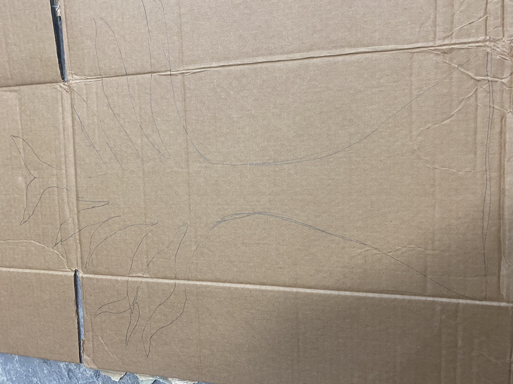

# Blog Post #4

## Updates:

I have continured working on the prototypes for the Soucouyant and Papa Bois. 

## What I did

### Soucouyant

After some trial and error I was able to get the flame to map onto the visual capture. However it is not very smooth. I think the lighting might be part of the issue and or the fact that I have darker skin. I want to user tesr with someone else but I am not allowed to have more people in my studio so I will have to put that on the back burner for now and continue figuring out how to do full body projection. 

The first step was to map the flame onto the video capture to ensure that it was actually following the face. See [here](https://youtu.be/ZWt9PVc6I3w)

The second step was to remove the vide so that only the flame could be seen to be projected onto the dancer. See [here](https://youtu.be/ZWt9PVc6I3w).

### Papa Bois

I started working on Prototypes for the trees. 

I looked up some set designes for forest and used those to create my own set. 

From this I drafted up my own set that I realised should incorporate both real plants and the LED trees. 

After this I created a smaller prototype tree. The goal is to create 3-4 larger versions in the seam shop next semester.

The next step is to add the neopixels but I'm not sure how to include all of them with minimal wiring. 

## Next Steps

The next steps would be work on the body mapping and continue developping the tree. I would also like to start working on another character, perhaps the douens.

## Reflection

I am really excited to see my capstone unfold. My Crit went really well and I got good solid feedbacl from my peers. Hearing them retail my project gave me a better sense of how the piece is being recieved. I realise there are many elements and I hope to make it all come together smoothly. However I cannot continue without acknowledging that I may have to narrow down. 

As of right now I have elements of each scene that I can clearly envision but I don't have the all the elements of any one scene in particular. With each prototype and each step I make, I am more acutely aware of how large scale the project could be and have to conciously make an effort to bring it together and have it not spiral out of control.

One of the things that my peers mentioned in the Crit that I will be taking into consideration is the 'why'. I am not fully sure what I am trying to portray in this project and I honestly don't know if I even need a larger higher purpose. But it is still definitely something to think about. 

Finally I want to end with a quote one of my peers said in my crit. My project allows them to "engage with a new culture in an intimate way"

Perhaps this is my 'why' - creating a medium through which the culture I have grown up with can be shared in a unique and intimate way

